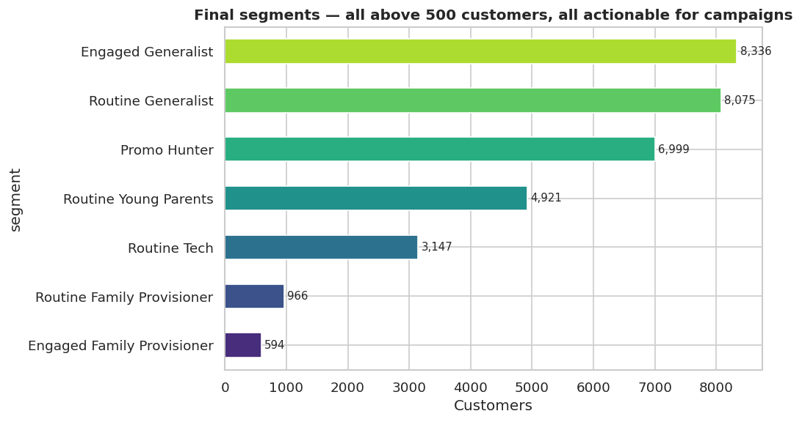
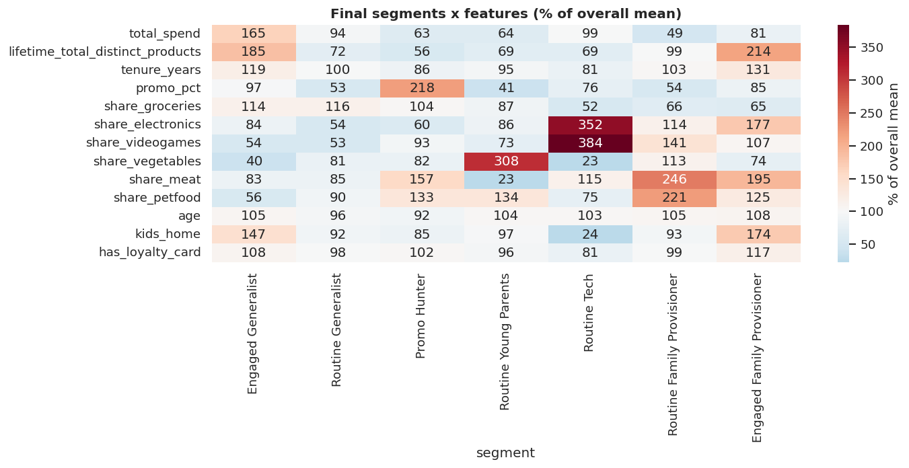
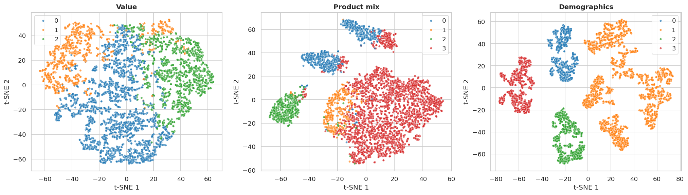

# Retail Customer Segmentation

Unsupervised segmentation of 33,038 retail customers into 7 actionable marketing segments, with per-segment promotion designs mined from 100,000 basket transactions.

**Live demo:** [customer-segmentation-retail.streamlit.app](https://customer-segmentation-retail.streamlit.app/)
   

Built as the graded project for Machine Learning II (NOVA IMS, Data Science degree). The data is synthetic course data — no real people. The raw export in `data/` is included so the pipeline is reproducible end to end; every artefact the pipeline *writes* has names, birthdates and coordinates stripped (`preprocessing.drop_identifiers`, asserted in notebook 02 and covered by a test).

## The problem

A retailer with 33k customers and 100k basket transactions wants to stop treating everyone the same: which groups exist in the customer base, what defines them, and what should each group be offered? The catch with clustering "customers" directly is that engagement and taste get mixed into one blob — a high-spending tech enthusiast and a high-spending grocery shopper land in the same cluster because spend dominates the distance metric.

This project separates the two questions. Customers are clustered twice, on disjoint feature sets — once on **value/engagement** (how much, how broadly, how often) and once on **product mix** (relative spend shares across 10 categories) — and the two labels are combined into a named segment through an explicit, documented business-rule layer. Every step of that layer is inspectable; nothing is a black box between the K-Means output and the segment a marketer sees.

## Results



| Segment | Size | What defines it |
|---|---|---|
| Engaged Generalist | 8,336 | The core loyal base. Highest spend, broadest baskets (275 distinct products against a population median of 123), 12.8-year average tenure. |
| Routine Generalist | 8,075 | Same grocery-heavy mix as the engaged group but ~108 distinct products and lower spend — the natural reactivation target. |
| Promo Hunter | 6,999 | 71% of purchases made on promotion (next-highest segment: 32%). Deal-driven regardless of category. |
| Routine Young Parents | 4,921 | Cluster profile says vegetables and hygiene; basket rules say babies food, napkins and cooking oil. Highest purchase frequency in the dataset. |
| Routine Tech | 3,147 | 40% of spend on electronics, fewest stores (1.5), smallest households. Produces the strongest rule in the data (bluetooth headphones → airpods, lift 4.0) — though by basket lift its real signature is personal care at 5× the population rate. See the caveat below. |
| Routine Family Provisioner | 966 | Balanced meat / fish / hygiene provisioning basket, moderate spend, low promo use (18%). |
| Engaged Family Provisioner | 594 | Small but valuable: the most distinct products of any segment (319), the longest tenure (14 years), the largest households. |

**The finding that shaped the whole analysis.** The two source files do not describe the same behaviour. `customer_info` gives lifetime spend per category; `customer_basket` gives the items people actually buy. Correlating them per customer, across all ten categories, gives rank correlations between **−0.19 and +0.05** — never meaningfully positive. The sharpest case: the segment with the *highest* electronics spend share (40%) has the *lowest* electronics basket share, and its basket signature is personal care at 5× the population rate.

This is almost certainly an artefact of how the synthetic course data was generated — the two files were built from independent latent profiles. It is measured in notebook 04 §3b rather than assumed either way, and it bounds what the promotions can claim: a design justified by an **association rule** stands on its own basket evidence, while one justified by a **spend profile** is a `customer_info` fact the baskets do not corroborate. Every promotion in `outputs/promotion_designs.csv` carries a `basis` column recording which it is.

A related trap the analysis avoids: **raw product frequency is not signal.** Asparagus and airpods are the two most common products overall (12.8% and 12.1% of all baskets), so they top nearly every segment's frequency list by construction. All segment characterisation is done on lift against the population rate.



**Promotions.** Association rules were mined per segment (Apriori, with a hard floor of 30 supporting baskets per rule so small segments can't produce statistical noise). The headline result is that the rules genuinely differ by segment — Routine Tech's top rule is bluetooth headphones → airpods (lift 4.0), Routine Young Parents' is napkins → cooking oil (lift 2.4), Engaged Generalists pair breakfast staples (butter + cereals → eggs, lift 2.6). A storewide promotion would misfire for most of these groups; the per-segment designs in `outputs/promotion_designs.csv` each cite the specific rule that justifies them.

## Methodology

### Clustering perspectives

Two clusterings are run on disjoint feature subsets and combined into the final segment label, plus a third reported for descriptive context only:

1. **Value / engagement perspective** (K=3) — log-total-spend, distinct products, distinct stores, tenure, promo percentage. This axis measures basket **breadth and engagement, not total spend**: the segment names use "Engaged" and "Routine", never "High-Value", because the engaged tier does not always have the highest mean spend (one engaged segment has lower mean spend than a routine one — see the spend table in notebook 03).
2. **Product-mix perspective** (K=4) — relative share of spend per category (10 share columns). The cluster that over-indexes on vegetables and hygiene is named **Young Parents** rather than "Healthy", because the basket-level association rules for these customers are dominated by babies food, napkins and cooking oil.
3. **Demographic perspective** (descriptive only) — age, household, education, hour, loyalty. Computed because the brief asks for demographic analysis; the crosstab comes back exactly 100% one degree level per cluster, so the perspective *is* the `degree` column. Not used in the final segment label and not persisted with the other models.

K-Means is the primary algorithm, validated against agglomerative (Ward linkage) clustering. K for each perspective is chosen using the elbow method, silhouette, Davies-Bouldin, and Calinski-Harabasz.



### Why K-Means and not DBSCAN / Mean-Shift / SOM

DBSCAN and Mean-Shift were tested and rejected with evidence (notebook 03, §1b): after scaling, the customers form a single dense cloud with no density valleys. With `eps` chosen from a k-distance plot, DBSCAN returns one cluster holding everything at and above the knee, and below the knee shatters into 23 micro-clusters with 11.7% of customers labelled noise — two different failures, neither actionable. Mean-Shift collapses to a single mode on the value perspective and one blob plus 62 fragments on the product mix.

**SOM was not run.** The argument for skipping it is that a self-organising map also imposes structure rather than discovering density valleys, so a 1×K SOM reduces to essentially the K-Means partition and would not test the question §1b is asking. That is reasoning, not evidence, and the notebook flags it as such rather than counting it alongside the two methods actually executed.

### Content-based cluster naming

Cluster names are derived from centroid characteristics (`argmax(promo_pct)` is the promo-hunter cluster, `argmax(share_electronics)` is the tech cluster, etc.), not from the integer cluster IDs K-Means produces. This makes the segmentation reproducible across random seeds and sklearn versions: the *names* stay the same even if K-Means shuffles the underlying IDs.

### Final segment assignment

The final segment label combines the **named** value and mix labels via a lookup table. This second stage is a **deliberate business-rule overlay, not a clustering algorithm**. Two business decisions are encoded: all `(promo_hunter, *)` combinations collapse to a single "Promo Hunter" segment (promo behaviour dominates product mix for that tier), and segments smaller than 200 customers are folded into their generalist counterpart (a 124-customer segment cannot support a marketing campaign).

To show the lookup is not arbitrary, notebook 03 also builds a **learned** alternative merge (Ward linkage on the joint value × mix cluster centroids, cut to the same number of groups) and reports the Adjusted Rand Index between the two. They agree substantially (ARI ~0.6), confirming the business rules encode real structure rather than wishful grouping.

### Validation

- **Stability**: K-Means refit with six different random seeds. Pairwise Adjusted Rand Index > 0.99 for both perspectives — the partition is essentially identical across seeds.
- **RFM baseline**: a Recency-Frequency-Monetary heuristic computed with quantile binning on tenure, store count and total spend. All three bins participate in the collapse rule, and notebook 03 crosstabs the labels against the recency bin to prove it. The ARI against the K-Means segmentation lands just under 0.1 — low is the good outcome here: a high ARI would mean the clustering had merely rediscovered the heuristic. The caveat is stated in the notebook: a low ARI shows the structure is *different*, not that it is *useful*; the per-segment basket evidence in notebook 04 is what supports usefulness.
- **Compositional-data check**: the product-mix features are compositional (each row sums to 1), so K-Means was also run on a centred-log-ratio (CLR) transformation and the partitions compared. **ARI 0.417** — partial agreement, and nothing stronger: the raw-shares grocery-generalist cluster holds 21,577 customers, its CLR counterpart 701. Notebook 03 shows the full crosstab and explains why running the naming function on the CLR labels would be circular evidence (it assigns all four names by construction and cannot fail). Raw shares are kept as the headline, with the disagreement documented as a limitation rather than resolved.
- **Scoring is batch-independent**: imputation medians and the 99th-percentile spend caps are fitted once on the training population and persisted alongside the scalers. Notebook 03 re-scores the 300 customers most exposed to capping alone, inside a random slice, and inside the full population, and asserts all three agree. Without frozen parameters those statistics get re-derived from whatever file is uploaded, and a customer near a cap can change segment depending on batch size.

### Promotions

Per-segment Apriori with an **adaptive `min_support`**: every reported rule must appear in at least 30 baskets of its segment, regardless of segment size. Each promotion design cites the specific rule(s) (with support and lift) that justify it. When the basket evidence is too thin to support a rule-driven promotion (the smallest two segments), the promotion is explicitly profile-driven and that is stated.

## Limitations, and what I'd do differently

- **The grid structure is a modelling choice with a real cost.** The 3×4 two-perspective design was chosen for interpretability, and it delivers that — but it imposes a grid on the data. Post-hoc comparison against a flat joint clustering suggests the data contains structure the grid cannot fully express: the two large generalist segments each smear across several clusters of a flat 9-way solution, and the Promo Hunter collapse merges distinctions a flat clustering keeps separate. If I rebuilt this, I would fit a flat clustering on the joint feature space first, characterise its clusters, and *then* decide whether a two-axis decomposition adds interpretability — rather than committing to the decomposition upfront.
- Silhouettes are in the 0.24–0.34 range across perspectives, indicating soft rather than well-separated clusters. The clusters are *stable* (ARI > 0.99 across seeds) rather than *tight*, and the per-cluster heatmaps carry the interpretability that geometric separation doesn't.
- All customers live in Lisbon, so geography carries no clustering signal. Results may not generalise to multi-city retailers.
- The demographic perspective is exactly the education feature (100% per cluster) and adds no independent segmentation signal. Reported as a finding rather than hidden.
- **The spend-share and basket views disagree systematically** (see Results). Segment *names* derive from spend shares and should be read as descriptions of share-of-wallet, not predictions about basket contents.
- No multiple-testing correction on the 2,334 mined rules. With that many candidates some high-lift values will be optimistic, especially in the two smallest segments where rules rest on 30–90 baskets. Mitigated by an absolute 30-basket floor rather than a formal correction, and stated in notebook 04 §6.

## Licence

Code in this repository is MIT licensed (see `LICENSE`). The datasets in
`data/` are synthetic teaching data provided by NOVA IMS for the course and are
not covered by that licence — they are included so the pipeline is reproducible.

## Repo structure

```
.
|-- data/                          Synthetic course data (customer_info.csv, customer_basket.csv)
|-- src/                           Reusable modules
|   |-- config.py                  Feature groups, paths, constants
|   |-- preprocessing.py           Cleaning and feature engineering
|   |-- clustering.py              K-Means, hierarchical, naming, persistence
|   |-- association_rules.py       Apriori per segment with adaptive support
|   |-- baselines.py               RFM heuristic and ARI comparison
|   `-- visualization.py           Plotting helpers
|-- notebooks/                     01 EDA, 02 preprocessing, 03 clustering, 04 promotions
|-- tests/                         pytest suite (18 tests)
|-- app/                           Streamlit demo (explorer, classifier, batch scoring)
|   `-- data/                      Precomputed aggregates the app reads (no customer rows)
|-- .streamlit/                    App theme
|-- outputs/
|   |-- customer_segments.csv      customer_id -> segment
|   |-- promotion_designs.csv      Campaign designs with cited rules
|   |-- models/                    Persisted scalers, KMeans models, naming maps,
|   |                              and the frozen preprocessing parameters
|   `-- figures/
`-- requirements.txt
```

**Note on viewing the notebooks.** 
**Viewing the notebooks.** `01_eda.ipynb` and `03_clustering.ipynb` are over 1 MB with outputs, past GitHub's inline renderer limit. Full renders on nbviewer: [01 EDA](https://nbviewer.org/github/heyydaniyal/customer-segmentation-retail/blob/main/notebooks/01_eda.ipynb) · [02 Preprocessing](https://nbviewer.org/github/heyydaniyal/customer-segmentation-retail/blob/main/notebooks/02_preprocessing.ipynb) · [03 Clustering](https://nbviewer.org/github/heyydaniyal/customer-segmentation-retail/blob/main/notebooks/03_clustering.ipynb) · [04 Promotions](https://nbviewer.org/github/heyydaniyal/customer-segmentation-retail/blob/main/notebooks/04_promotions.ipynb)

## Running it

```bash
python -m venv .venv
source .venv/bin/activate          # Windows: .venv\Scripts\activate
pip install -r requirements.txt
```

Run the notebooks in order (01 → 04). Notebook 03 produces `outputs/customer_segments.csv` and persists the fitted models. Tests: `pytest tests/`.

### Demo app

```bash
 https://customer-segmentation-retail.streamlit.app/
```

Four tabs: a segment explorer, a single-customer classifier (with one-click
personas built from real segment medians), per-segment promotion designs, and
batch scoring - upload a CSV in the `customer_info.csv` schema and download
every row's segment. The app reads only precomputed aggregates
(`app/data/`, built by `app/prep_app_data.py`) plus the persisted models;
it never loads customer-level data.

### Classifying a new customer

```python
from src import preprocessing as pp
from src import clustering as clu

models = clu.load_models()                                   # scalers, KMeans, naming maps, preprocessing params
new_df = pp.build_features(new_raw_df, models["preproc_params"])
predictions = clu.predict_segment(new_df, models=models)
# -> DataFrame with columns: value_cluster, mix_cluster, segment
```

Passing `models["preproc_params"]` is what makes the answer a property of the customer rather than of the batch: it applies the imputation medians and spend caps fitted on the training population instead of re-deriving them from `new_raw_df`. `pp.build_features(new_raw_df)` without params fits-then-transforms, which is correct for a training run and wrong for scoring.
